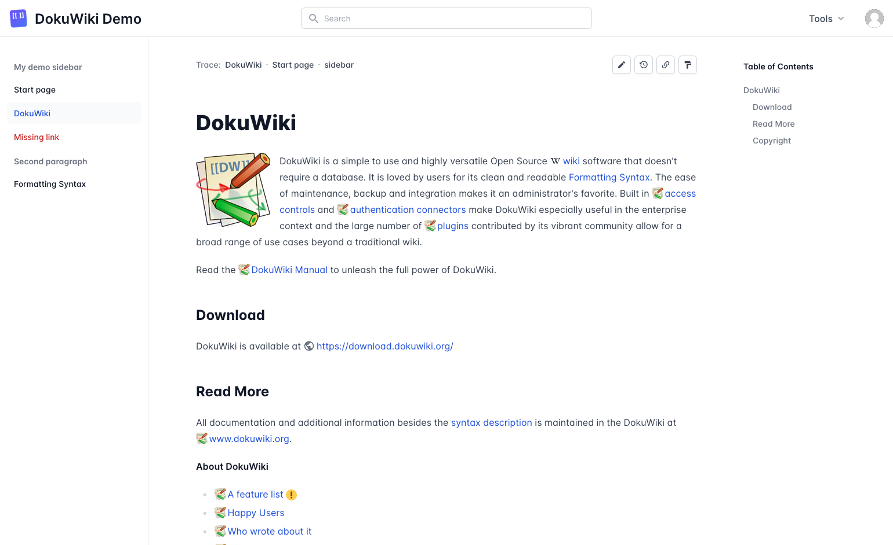

# TailwindCSS DokuWiki Template

"Tailwind" is a modern, minimal template for DokuWiki, created with TailwindCSS and Flowbite.
This template supports Light and Dark mode and is also responsive.



(See the "screenshots" folder for more screenshots.)

Currently, only the languages "en" and "de" are supported.
The tested version is "2023-04-04" ("Jack Jackrum").

The following plugins are supported:
  * [wrap](https://www.dokuwiki.org/plugin%3Awrap)
  * [move](https://www.dokuwiki.org/plugin%3Amove)
  * [diagrams](https://www.dokuwiki.org/plugin%3Adiagrams)
  * [imagebox](https://www.dokuwiki.org/plugin%3Aimagebox)

I am open to merge requests for changes like for the support of additional plugins.

## Installation

If this template is installed manually, it must be installed in the directory **lib/tpl/tailwind**.
Otherwise, this template will not work.

## Build

The CSS files can be compiled with the following command:

```bash
npm run build
```

## Compiling Scrollspy

For the dynamic highlighting of the current section, the [Bootstrap](https://github.com/twbs/bootstrap) component "[Scrollspy](https://getbootstrap.com/docs/5.1.3/components/scrollspy/)" is used.
Note, that the version ≤ 5.1.3 is used, as newer versions have a different functionality and work differently.
To optimize the Bootstrap files, all unnecessary imports and exports in the files **js/index.\*.js** can be removed, except the `Scrollspy` object.

Furthermore, not all pages have a table of contents.
In these cases, an error message may be shown in the console when scrolling.
To fix this, either modify the Bootstrap library to ignore when the table of contents does not exist,
or activate Scrollspy from the backend side only when the table of contents exists.

To modify the Bootstrap library, add the following code within the function `_activate()` in the file **js/src/scrollspy.js**:

```diff
  const link = SelectorEngine.findOne(queries.join(','), this._config.target)

+ if (!link) {
+   return
+ }
+
  link.classList.add(CLASS_NAME_ACTIVE)
```

Then, compile Bootstrap with the following command:

```bash
npm run js
```

The Bootstrap files **bootstrap.min.js** and **bootstrap.min.js.map** are then copied to the **assets/js** directory in the Tailwind template under the names **bootstrap-scrollspy.min.js** and **bootstrap-scrollspy.min.js.map**.
